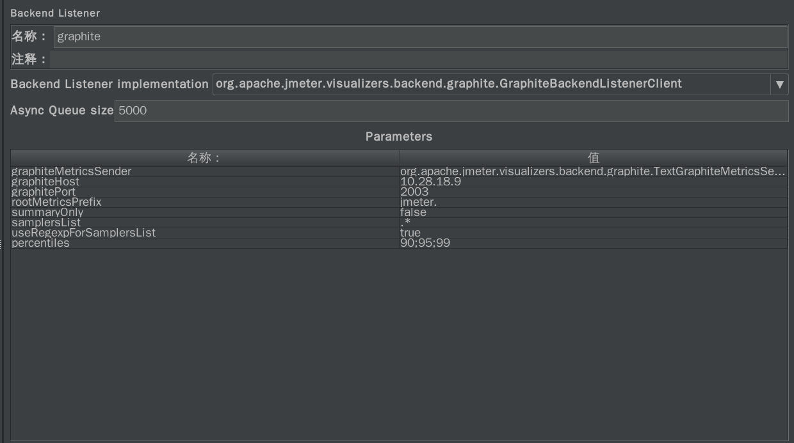
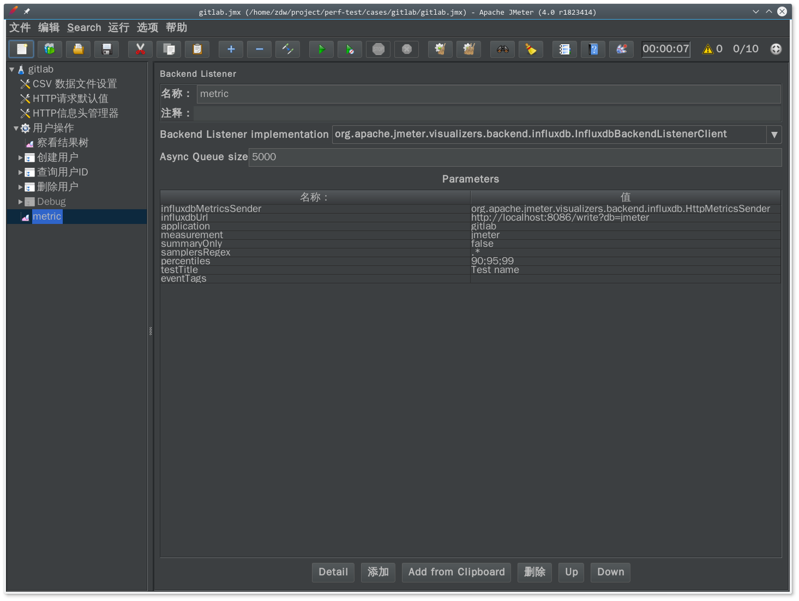
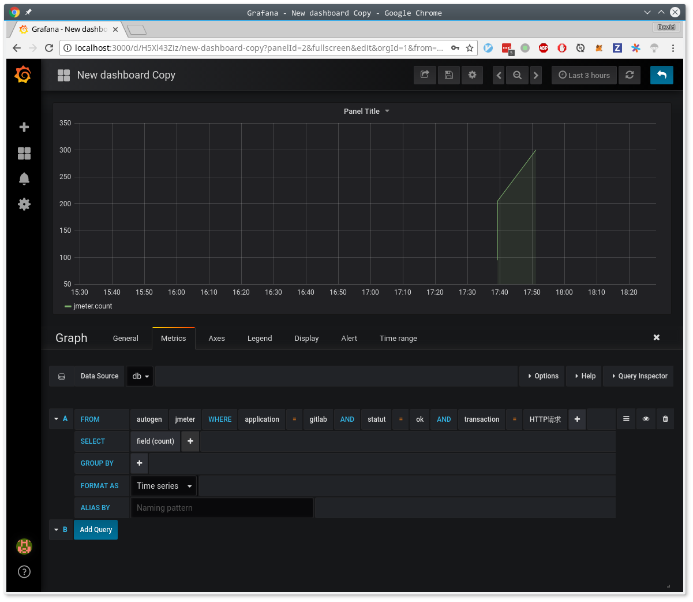

grafana ref:

https://hub.docker.com/r/grafana/grafana/


influxdb ref:

https://hub.docker.com/_/influxdb/


create config file

$ docker run --rm influxdb influxd config > influxdb.conf

open graphite, http, udp options


create db

```
curl -X POST http://localhost:8086/query --data-urlencode "q=CREATE DATABASE jmeter"
curl -X POST http://localhost:8086/query --data-urlencode "q=CREATE DATABASE cadvisor"
curl -X POST http://localhost:8086/query --data-urlencode "q=CREATE DATABASE gitlab"
```

如果使用了2003端口，那么采集的数据会存放在graphite数据库中




jmeter

metric to influxdb
http://jmeter.apache.org/usermanual/realtime-results.html

parse config params http://jmeter.apache.org/usermanual/component_reference.html#Backend_Listener

1. jmeter add backend listener




2. 配置选项

- backend listener implementation 选择 influxdb

params:
- influxdbMetricsSender，保持不动
- influxdbUrl，选择db服务的地址，db名称保持一致
- application，自己命名，后期作为筛选条件
- measurement，保持jmeter不动
- summaryOnly，改为false，不只需要一个总结统计
- samplersRegex，可以与application结合起来，绑定一组samplers
- percentiles，保持默认即可，百分比统计
- testTitle，测试名称，存储在influxdb events 中的 text 字段中
- eventTags，用来进行标注，暂时用不到

3. db数据分析

`docker exec -it collector_db_1 influx`

进入容器并执行influx shell程序

```
> help

> show databases
name: databases
name
----
_internal
jmeter
docker
gitlab

> use jmeter
Using database jmeter

> show series
key
---
events,application=gitlab,title=ApacheJMeter
jmeter,application=gitlab,statut=all,transaction=HTTP请求
jmeter,application=gitlab,statut=all,transaction=all
jmeter,application=gitlab,statut=all,transaction=创建用户
jmeter,application=gitlab,statut=all,transaction=删除用户
jmeter,application=gitlab,statut=all,transaction=查询用户ID
jmeter,application=gitlab,statut=ok,transaction=HTTP请求
jmeter,application=gitlab,statut=ok,transaction=创建用户
jmeter,application=gitlab,statut=ok,transaction=删除用户
jmeter,application=gitlab,statut=ok,transaction=查询用户ID
jmeter,application=gitlab,transaction=internal

> show field keys
name: events
fieldKey fieldType
-------- ---------
text     string

name: jmeter
fieldKey   fieldType
--------   ---------
avg        float
count      float
countError float
endedT     float
hit        float
max        float
maxAT      float
meanAT     float
min        float
minAT      float
pct90.0    float
pct95.0    float
pct99.0    float
startedT   float
```

- 数据全部存储在jmeter数据库中
- series可以理解为表，最前面的为表名，如events，jmeter，后续的键值可以理解为选择表的条件，必需将
  所有列限定，才算作指定一个表，取到其中存储的数据
- field keys可以理解为表中的列，每一个key其中都存储了相应数据，类型由fieldType标识


4. 配置grafana

理解数据结构之后，再来配置grafana就简单一些



- 其中最前面的为表名
- where标明了表的限定条件，这里使用了3个条件，才完全限定了一个表
- select标明了数据列的取值
- group by一般不用


## metric analysis

### jmeter


ref: 

```
$ docker exec -it collector_db_1 influx --database 'jmeter' -execute 'show field keys'
name: events
fieldKey fieldType
-------- ---------
text     string

name: jmeter
fieldKey   fieldType
--------   ---------
avg        float
count      float
countError float
hit        float
max        float
min        float
maxAT      float
minAT      float
meanAT     float
startedT   float
endedT     float
pct90.0    float
pct95.0    float
pct99.0    float
```

- events
  - text, ？？
- jmeter
  - avg, 平均响应时间
  - count, 请求数量
  - countError, 请求失败数量
  - hit, 服务器每秒hit数
  - max, 最大响应时间
  - min, 最小响应时间
  - maxAT, Max active threads
  - minAT, Min active threads
  - meanAT, Mean active threads
  - startedT, Started threads
  - endedT, Finished threads
  - pct90.0, 90%响应时间，意思是所有有90%的响应都可以在此时间内完成
  - pct95.0, 类上
  - pct99.0, 类上


### graphite

ref: http://jmeter.apache.org/usermanual/realtime-results.html#metrics-response-times


jmeter本身的情况，rootMetricsPrefix是自己定义的值
- <rootMetricsPrefix>test.minAT, Min active threads
- <rootMetricsPrefix>test.maxAT, Max active threads
- <rootMetricsPrefix>test.meanAT, Mean active threads
- <rootMetricsPrefix>test.startedT, Started threads
- <rootMetricsPrefix>test.endedT, Finished threads 

响应时间的统计情况，samplerName是取样器的值，包括一个特殊的all（包含所有的sampler的和）；percentileValue是自己定义的百分比，默认是90，95，99
- <rootMetricsPrefix><samplerName>.ok.count, Number of successful responses for sampler name
- <rootMetricsPrefix><samplerName>.h.count, Server hits per seconds, this metric cumulates Sample Result and Sub results (if using Transaction Controller, "Generate parent sampler" should be unchecked)
- <rootMetricsPrefix><samplerName>.ok.min, Min response time for successful responses of sampler name
- <rootMetricsPrefix><samplerName>.ok.max, Max response time for successful responses of sampler name
- <rootMetricsPrefix><samplerName>.ok.avg, Average response time for successful responses of sampler name.
- <rootMetricsPrefix><samplerName>.ok.pct<percentileValue>, Percentile computed for successful responses of sampler name. There will be one metric for each calculated value.

- <rootMetricsPrefix><samplerName>.ko.count, Number of failed responses for sampler name
- <rootMetricsPrefix><samplerName>.ko.min, Min response time for failed responses of sampler name
- <rootMetricsPrefix><samplerName>.ko.max, Max response time for failed responses of sampler name
- <rootMetricsPrefix><samplerName>.ko.avg, Average response time for failed responses of sampler name.
- <rootMetricsPrefix><samplerName>.ko.pct<percentileValue>, Percentile computed for failed responses of sampler name. There will be one metric for each calculated value.

- <rootMetricsPrefix><samplerName>.a.count, Number of responses for sampler name (sum of ok.count and ko.count)
- <rootMetricsPrefix><samplerName>.a.min, Min response time for responses of sampler name (min of ok.count and ko.count)
- <rootMetricsPrefix><samplerName>.a.max, Max response time for responses of sampler name (max of ok.count and ko.count)
- <rootMetricsPrefix><samplerName>.a.avg, Average response time for responses of sampler name (avg of ok.count and ko.count)
- <rootMetricsPrefix><samplerName>.a.pct<percentileValue>, Percentile computed for responses of sampler name. There will be one metric for each calculated value. (calculated on the totals for OK and failed samples) 


```
$ docker exec -it collector_db_1 influx --database 'graphite' -execute 'show field keys'
name: jmeter.test.endedT
fieldKey fieldType
-------- ---------
value    float

name: jmeter.test.maxAT
fieldKey fieldType
-------- ---------
value    float

name: jmeter.test.meanAT
fieldKey fieldType
-------- ---------
value    float

name: jmeter.test.minAT
fieldKey fieldType
-------- ---------
value    float

name: jmeter.test.startedT
fieldKey fieldType
-------- ---------
value    float

name: jmeter.HTTP请求.a.avg
fieldKey fieldType
-------- ---------
value    float

name: jmeter.HTTP请求.a.count
fieldKey fieldType
-------- ---------
value    float

name: jmeter.HTTP请求.a.max
fieldKey fieldType
-------- ---------
value    float

name: jmeter.HTTP请求.a.min
fieldKey fieldType
-------- ---------
value    float

name: jmeter.HTTP请求.a.pct90
fieldKey fieldType
-------- ---------
value    float

name: jmeter.HTTP请求.a.pct95
fieldKey fieldType
-------- ---------
value    float

name: jmeter.HTTP请求.a.pct99
fieldKey fieldType
-------- ---------
value    float

name: jmeter.HTTP请求.h.count
fieldKey fieldType
-------- ---------
value    float

name: jmeter.HTTP请求.ko.avg
fieldKey fieldType
-------- ---------
value    float

name: jmeter.HTTP请求.ko.count
fieldKey fieldType
-------- ---------
value    float

name: jmeter.HTTP请求.ko.max
fieldKey fieldType
-------- ---------
value    float

name: jmeter.HTTP请求.ko.min
fieldKey fieldType
-------- ---------
value    float

name: jmeter.HTTP请求.ko.pct90
fieldKey fieldType
-------- ---------
value    float

name: jmeter.HTTP请求.ko.pct95
fieldKey fieldType
-------- ---------
value    float

name: jmeter.HTTP请求.ko.pct99
fieldKey fieldType
-------- ---------
value    float

name: jmeter.HTTP请求.ok.avg
fieldKey fieldType
-------- ---------
value    float

name: jmeter.HTTP请求.ok.count
fieldKey fieldType
-------- ---------
value    float

name: jmeter.HTTP请求.ok.max
fieldKey fieldType
-------- ---------
value    float

name: jmeter.HTTP请求.ok.min
fieldKey fieldType
-------- ---------
value    float

name: jmeter.HTTP请求.ok.pct90
fieldKey fieldType
-------- ---------
value    float

name: jmeter.HTTP请求.ok.pct95
fieldKey fieldType
-------- ---------
value    float

name: jmeter.HTTP请求.ok.pct99
fieldKey fieldType
-------- ---------
value    float

```


### cadvisor

ref: https://docs.docker.com/engine/reference/commandline/stats/#examples

https://github.com/google/cadvisor/blob/c094ef0d2a3de380d516ff26bca13d2585ffe58f/storage/influxdb/influxdb.go#L52

- cpu_usage_per_cpu
- cpu_usage_system
- cpu_usage_total
- cpu_usage_user
- fs_limit
- fs_usage
- load_average
- memory_usage
- memory_working_set
- rx_bytes, 收到网络字节数
- rx_errors，
- tx_bytes， 发出网络字节数
- tx_errors


``
$ docker exec -it collector_db_1 influx --database 'cadvisor' -execute 'show field keys'
name: cpu_usage_per_cpu
fieldKey fieldType
-------- ---------
value    integer

name: cpu_usage_system
fieldKey fieldType
-------- ---------
value    integer

name: cpu_usage_total
fieldKey fieldType
-------- ---------
value    integer

name: cpu_usage_user
fieldKey fieldType
-------- ---------
value    integer

name: fs_limit
fieldKey fieldType
-------- ---------
value    integer

name: fs_usage
fieldKey fieldType
-------- ---------
value    integer

name: load_average
fieldKey fieldType
-------- ---------
value    integer

name: memory_usage
fieldKey fieldType
-------- ---------
value    integer

name: memory_working_set
fieldKey fieldType
-------- ---------
value    integer

name: rx_bytes
fieldKey fieldType
-------- ---------
value    integer

name: rx_errors
fieldKey fieldType
-------- ---------
value    integer

name: tx_bytes
fieldKey fieldType
-------- ---------
value    integer

name: tx_errors
fieldKey fieldType
-------- ---------
value    integer

```


### gitlab

ref: https://docs.gitlab.com/ee/administration/monitoring/performance/influxdb_schema.html


- PROCESS_file_descriptors
  - 打开的文件描述符数量
- PROCESS_gc_statistics
  - 涉及ruby虚拟机中gc相关的数据
- PROCESS_memory_usage
  - 进程内存使用量，单位byte
- PROCESS_method_calls，方法调用数据统计
  - call_count，调用次数
  - cpu_duration，消耗cpu时间
  - duration, 方法调用消耗时间
- PROCESS_object_counts
  - 对class的对象计数，涉及ruby底层
- PROCESS_transactions
  - duration，一次transcation消耗的时间
  - allocated_memory, bytes，一次transcation中新分配的内存
  - method_duration，在method calls中耗费的时间
  - sql_duration，在sql查询中耗费的时间
  - view_duration, 生成view的时间
- PROCESS_views
  - duration, view渲染花费的时间
- events, 统计事件发生的次数


```
$ docker exec -it collector_db_1 influx --database 'gitlab' -execute 'show field keys'
name: events
fieldKey fieldType
-------- ---------
count    float

name: rails_file_descriptors
fieldKey fieldType
-------- ---------
value    float

name: rails_gc_statistics
fieldKey                                fieldType
--------                                ---------
count                                   float
heap_allocatable_pages                  float
heap_allocated_pages                    float
heap_available_slots                    float
heap_eden_pages                         float
heap_final_slots                        float
heap_free_slots                         float
heap_live_slots                         float
heap_marked_slots                       float
heap_sorted_length                      float
heap_swept_slots                        float
heap_tomb_pages                         float
major_gc_count                          float
malloc_increase_bytes                   float
malloc_increase_bytes_limit             float
minor_gc_count                          float
old_objects                             float
old_objects_limit                       float
oldmalloc_increase_bytes                float
oldmalloc_increase_bytes_limit          float
remembered_wb_unprotected_objects       float
remembered_wb_unprotected_objects_limit float
total_allocated_objects                 float
total_allocated_pages                   float
total_freed_objects                     float
total_freed_pages                       float
total_time                              float

name: rails_memory_usage
fieldKey fieldType
-------- ---------
value    float

name: rails_method_calls
fieldKey     fieldType
--------     ---------
call_count   float
cpu_duration float
duration     float

name: rails_object_counts
fieldKey fieldType
-------- ---------
count    float

name: rails_transactions
fieldKey                           fieldType
--------                           ---------
allocated_memory                   float
banzai_cacheless_render_call_count float
banzai_cacheless_render_cpu_time   float
banzai_cacheless_render_real_time  float
cache_count                        float
cache_duration                     float
cache_read_count                   float
cache_read_duration                float
cache_read_hit_count               float
cache_read_miss_count              float
cache_write_count                  float
cache_write_duration               float
duration                           float
new_redis_connections              float
rails_queue_duration               float
request_method                     string
request_uri                        string
sql_count                          float
sql_duration                       float
view_duration                      float

name: rails_views
fieldKey fieldType
-------- ---------
duration float

name: sidekiq_file_descriptors
fieldKey fieldType
-------- ---------
value    float

name: sidekiq_gc_statistics
fieldKey                                fieldType
--------                                ---------
count                                   float
heap_allocatable_pages                  float
heap_allocated_pages                    float
heap_available_slots                    float
heap_eden_pages                         float
heap_final_slots                        float
heap_free_slots                         float
heap_live_slots                         float
heap_marked_slots                       float
heap_sorted_length                      float
heap_swept_slots                        float
heap_tomb_pages                         float
major_gc_count                          float
malloc_increase_bytes                   float
malloc_increase_bytes_limit             float
minor_gc_count                          float
old_objects                             float
old_objects_limit                       float
oldmalloc_increase_bytes                float
oldmalloc_increase_bytes_limit          float
remembered_wb_unprotected_objects       float
remembered_wb_unprotected_objects_limit float
total_allocated_objects                 float
total_allocated_pages                   float
total_freed_objects                     float
total_freed_pages                       float
total_time                              float

name: sidekiq_memory_usage
fieldKey fieldType
-------- ---------
value    float

name: sidekiq_method_calls
fieldKey     fieldType
--------     ---------
call_count   float
cpu_duration float
duration     float

name: sidekiq_object_counts
fieldKey fieldType
-------- ---------
count    float

name: sidekiq_transactions
fieldKey                           fieldType
--------                           ---------
allocated_memory                   float
banzai_cacheless_render_call_count float
banzai_cacheless_render_cpu_time   float
banzai_cacheless_render_real_time  float
cache_count                        float
cache_duration                     float
cache_read_count                   float
cache_read_duration                float
cache_read_hit_count               float
duration                           float
new_redis_connections              float
sidekiq_queue_duration             float
sql_count                          float
sql_duration                       float
view_duration                      float

name: sidekiq_views
fieldKey fieldType
-------- ---------
duration float


```


