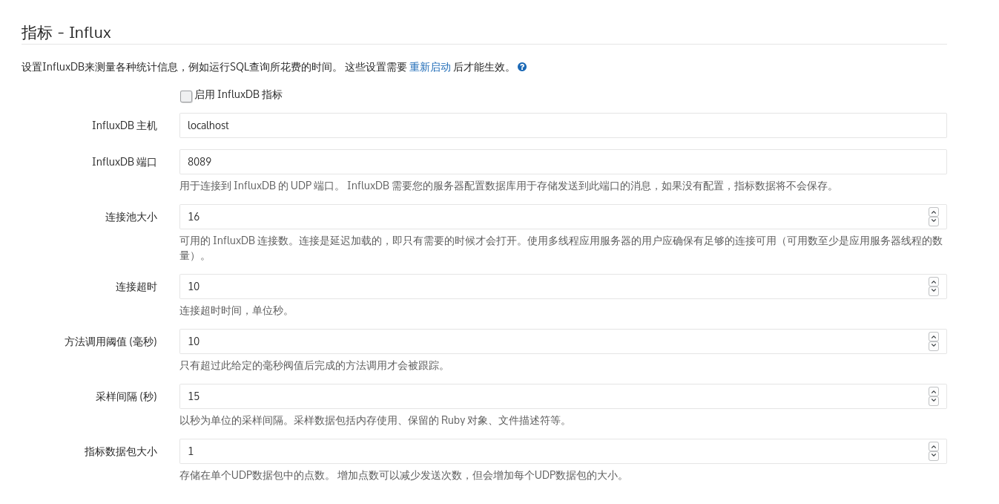

## 限制docker资源

https://docs.docker.com/config/containers/resource_constraints/#--memory-swap-details

limit resource config in docker-compose only in 2.2+ version, not 3.0+

https://docs.docker.com/compose/compose-file/compose-file-v2/#cpu-and-other-resources

## deploy docker gitlab

https://docs.gitlab.com/omnibus/docker/

## gitlab采集metric

root帐户，登陆gitlab后台，配置influxdb

- 启用influxdb指标，勾选
- 主机，ip地址
- 端口，保持默认，注意是udp端口，要在influxdb上开启对应端口
- 连接池大小，保持默认
- 连接超时，默认
- 方法调用阈值，默认
- 采样间隔，越小越好，设置为1
- 指标数据包大小，目前先保持为1，后续看收集情况

## docker 采集 metric

